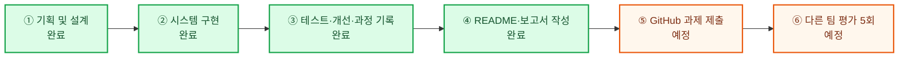
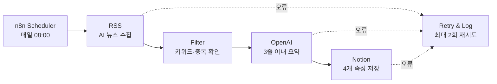

# RSS 기반 AI 뉴스 요약 자동화 시스템

## 1. 미션 개요

이번 미션은 자동화 도구 **n8n**을 사용하여 RSS를 통해 국내외 AI 관련 뉴스를 자동으로 수집하고, 생성형 AI로 기사 내용을 요약한 뒤 Notion 데이터베이스에 저장하는 자동화 워크플로우를 구현하는 프로젝트이다.

기존 기획안에서는 ‘국내외 주식시장 현황’을 뉴스 주제로, ‘내 집 마련을 목표로 하는 30대 투자자’를 대상 독자로 설정하였다. 그러나 프로젝트 진행 과정에서 실제 학습 목적과 팀의 관심 분야를 반영하여 다음과 같이 변경하였다.

- 뉴스 주제: 국내외 AI 관련 뉴스
- 대상 독자: AI를 공부하는 대학생
- 제공 정보: AI 산업·기업·기술 동향을 쉽게 이해할 수 있는 핵심 뉴스 요약
- 자동화 도구: n8n
- 저장 위치: Notion 데이터베이스

이를 통해 AI를 공부하는 대학생들이 여러 뉴스 사이트를 일일이 방문하지 않고도 최신 AI 동향을 빠르게 확인할 수 있는 시스템을 구축하고자 하였다.

## 2. 미션의 목적

AI 분야는 기술과 산업 동향이 빠르게 변화하기 때문에 지속적인 정보 탐색이 중요하다. 그러나 매일 여러 뉴스 사이트에서 관련 기사를 검색하고, 필요한 기사를 선별해 내용을 정리하는 작업에는 많은 시간이 필요하다.

이번 미션의 주요 목적은 반복적인 뉴스 수집과 정리 과정을 자동화하여 사용자가 기사 분석과 AI 학습에 더 집중할 수 있도록 하는 것이다.

구체적인 목적은 다음과 같다.

- RSS를 이용해 국내외 AI 관련 뉴스를 자동으로 수집한다.
- 수집된 기사 중 AI 주제와 관련된 기사를 선별한다.
- 생성형 AI를 활용해 기사 내용을 짧고 이해하기 쉽게 요약한다.
- 기사 제목, 요약문, 원문 링크, 발행일을 Notion에 자동 저장한다.
- n8n과 생성형 AI를 연결하는 전체 자동화 시스템 구현 과정을 학습한다.
- 시스템 실행 과정에서 발생하는 오류와 해결 방법을 기록한다.

## 3. 대상 사용자와 요구사항

### 대상 사용자

AI를 공부하는 대학생

### 사용자의 주요 요구

- 국내외 AI 관련 최신 뉴스를 간편하게 확인하고 싶다.
- 긴 기사를 전부 읽기 전에 핵심 내용을 먼저 파악하고 싶다.
- 원문이 필요한 경우 저장된 링크를 통해 기사 전문을 확인하고 싶다.
- 수집한 뉴스를 Notion에서 날짜별로 관리하고 싶다.
- 반복적인 뉴스 검색과 정리 시간을 줄이고 싶다.

## 4. 시스템 구현 및 진행 현황

### 4.1 팀원별 역할 배분과 수행 현황

기획안의 역할 배분을 기준으로 팀원별 담당 업무와 현재 수행 상태를 정리하면 다음과 같다.

| 구분 | 담당 업무 | 담당자 | 현재 상태 |
|---|---|---|---|
| 팀 운영 및 일정 관리 | 팀원 소통, 전체 일정 관리, 회의 진행, 역할 조율, 최종 자료 취합 및 GitHub 업로드 | 김용덕 | 진행 중 |
| 기획서·README·보고서 작성 및 검수 | 프로젝트 기획서와 보고서 작성, 구조 설명, 키워드 선정 이유 및 오류 처리 정책 정리, 최종 문서 검수 | 이창민, 이혜경, 김재욱, 조현주 | 완료 |
| 시스템 구현·테스트·과정 기록 | n8n 자동화 워크플로우 구축, RSS 수집, AI 뉴스 필터링, AI 요약, Notion 저장, 중복 방지, 오류 처리, 테스트 및 화면 기록 | 김재욱, 이창민, 조현주 | **완료** |
| 다른 팀 평가받기 | 5개 팀과 일정 조율, 시스템 시연, 질의응답, 평가 의견 수집 및 피드백 정리 | 김용덕, 이혜경, 조현주 | 예정 |

### 4.2 업무 진행 순서와 현재 위치



| 단계 | 상태 | 완료하거나 챙겨야 할 내용 |
|---|---|---|
| ① 기획 및 설계 | 완료 | 요구사항 분석, RSS 선정, AI 뉴스 주제와 대상 사용자 변경, 워크플로우 설계 |
| ② 시스템 구현 | 완료 | n8n 스케줄 트리거, RSS 수집, AI 뉴스 필터링, AI 요약, Notion DB 저장 구현 |
| ③ 테스트·개선·과정 기록 | 완료 | 자동 실행 시험, 결과 확인, 프롬프트와 필터 점검, 실행 화면 및 Notion 결과 기록 |
| ④ README·보고서 작성 | 완료 | 주제 변경 사항, 팀원별 결과, 오류 및 해결 과정, 워크플로우 화면을 최종 문서에 반영 |
| ⑤ GitHub 과제 제출 | 예정 | README, 보고서, 워크플로우 및 결과 스크린샷 업로드와 공개 전 API 키 점검 |
| ⑥ 다른 팀 평가받기 | 예정 | 5개 팀 대상 시연과 질의응답, 평가 의견 수집, 피드백 반영 내용 기록 |

### 4.3 6단계 상세 설계단계

기획안의 기존 주식시장 중심 설계를 **‘국내외 AI 관련 뉴스’와 ‘AI를 공부하는 대학생’**에 맞게 다음과 같이 수정하였다.

실제 자동화 워크플로우는 **n8n**으로 구현하였다. 아래 Make 화면은 워크플로우의 구성과 배치 방식을 설명하기 위해 임시로 삽입한 **참고용 이미지**이며, 팀원에게서 n8n 작업 화면을 전달받으면 실제 n8n 워크플로우 이미지로 교체할 예정이다.


| 단계 | 설정 내용 | 상세 설계 |
|---|---|---|
| ① 스케줄 트리거 | n8n Schedule Trigger로 매일 08:00, Asia/Seoul 기준 자동 실행 | 대학생이 수업이나 학습을 시작하기 전에 최신 AI 뉴스를 확인할 수 있도록 매일 아침 워크플로우를 실행한다. |
| ② 데이터 수집 | 국내외 AI·기술 뉴스 RSS | RSS에서 기사 제목, 본문 또는 설명, 원문 링크, 발행일시를 수집한다. 국내외 자료를 함께 수집해 특정 국가나 매체에 편중되지 않도록 한다. |
| ③ 주제 필터링 | AI 관련 키워드와 기사 연관성 확인 | ‘AI’, ‘인공지능’, ‘생성형 AI’, ‘머신러닝’, ‘딥러닝’, ‘LLM’, ‘ChatGPT’, ‘AI 반도체’ 등의 키워드를 기준으로 관련 기사를 선별한다. 단순히 AI라는 단어만 포함된 기사보다 AI 기술·산업·교육과 직접 관련된 기사를 우선한다. |
| ④ AI 콘텐츠 가공 | 대학생이 이해하기 쉬운 3줄 이내 요약 | 생성형 AI가 핵심 사실을 3줄 이내로 요약한다. 어려운 전문용어는 쉬운 표현으로 풀고, 해당 뉴스가 AI 학습자에게 중요한 이유를 알 수 있도록 작성한다. 투자 권유나 주식시장 중심의 해석은 제외한다. |
| ⑤ 데이터베이스 적재 | Notion의 4개 속성에 매핑 | `제목(Title)`, `요약문(Text)`, `원문링크(URL)`, `발행일시(Date)`에 결과를 저장한다. 원문 확인과 날짜별 정리가 가능하도록 각 값을 정확한 속성에 연결한다. |
| ⑥ 안정성 및 중복 방지 | 원문 URL을 고유 기준으로 사용 | 이미 저장된 원문 링크가 있으면 중복 등록을 차단한다. RSS 수집, AI 요약 또는 Notion 저장에 실패하면 최대 2회 재시도하고, 계속 실패할 경우 오류 로그를 남겨 담당자가 확인할 수 있도록 한다. |

### 4.4 주요 설계항목과 근거

기능을 단순히 연결하는 데 그치지 않고, 비용·정확도·사용 편의성과 운영 안정성을 고려해 다음과 같이 설계하였다.

| 설계 항목 | 선택 이유 |
|---|---|
| n8n 기반 자동화 | 스케줄 실행, RSS 수집, 필터링, OpenAI 요약, Notion 저장 단계를 하나의 워크플로우로 연결하고 실행 결과와 오류 흐름을 관리하기 위해 n8n을 사용하였다. |
| RSS 기반 수집 | Google News RSS를 출처로 사용하였다. 정해진 형식으로 최신 기사 정보를 받을 수 있어 별도 웹 크롤링보다 구현이 단순하고, 저작권 및 사이트 구조 변경 위험을 줄일 수 있다. |
| 요약 전 키워드 필터링 | OpenAI API 호출 전에 ‘AI’, ‘LLM’, ‘ChatGPT’ 등의 키워드로 1차 선별하여 AI와 무관한 기사를 요약 단계에서 제외한다. 이를 통해 불필요한 API 호출과 비용을 줄인다. |
| 3줄 이내 요약 | AI를 공부하는 대학생이 여러 기사의 핵심을 짧은 시간 안에 비교할 수 있도록 출력 길이를 제한한다. |
| 쉬운 표현과 핵심 기술 포함 | 대학생의 학습 목적에 맞게 전문용어만 나열하지 않고, 기사에 등장하는 핵심 기술·기업과 중요성을 이해할 수 있도록 한다. |
| 원문 URL을 고유 기준으로 사용 | 기사 제목은 수정되거나 서로 같을 수 있으므로, 원문 URL을 기준으로 중복 여부를 확인해 동일 기사 저장과 불필요한 AI 재호출을 막는다. |
| Notion DB 저장 | 팀원이 같은 결과를 함께 확인하고 수정할 수 있으며, 제목·요약·링크·발행일을 구조적으로 관리하기 쉽다. |
| 단계별 재시도와 로그 기록 | 일시적인 네트워크 또는 API 오류로 전체 흐름이 중단되는 것을 줄이고, 최종 실패 원인을 담당자가 추적할 수 있도록 한다. |

### 4.5 AI 요약 프롬프트

OpenAI API가 기사마다 일정한 형식과 난이도로 요약하도록 다음 프롬프트를 적용한다.

```text
당신은 AI 뉴스 전문 편집자입니다.

다음 기사를 AI를 공부하는 대학생이 이해하기 쉽게 요약하세요.

작성 조건:
1. 전체 내용을 3줄 이내로 요약합니다.
2. 기사에 등장하는 핵심 AI 기술 또는 기업명을 포함합니다.
3. 어려운 전문용어는 쉬운 표현으로 설명합니다.
4. 확인되지 않은 내용을 추측하거나 투자 조언을 추가하지 않습니다.
5. 기사 제목과 본문의 핵심 사실만 사용합니다.

기사 제목: {{title}}
기사 내용: {{description}}
```

이 프롬프트는 출력 길이와 필수 요소를 명확히 지정하여 요약 결과의 일관성을 높이고, 기존 투자자 대상 문구가 결과에 섞이지 않도록 제한하는 목적이 있다.

### 4.6 시스템 구조도

전체 시스템은 **n8n**에서 구현하였으며, 핵심 데이터 흐름은 **Scheduler → RSS → Filter → OpenAI → Notion** 순서로 구성된다.



## 5. Notion 데이터베이스 구현 결과

구축한 Notion 데이터베이스의 이름은 **‘AI 뉴스 요약 자동화’**이다.

데이터베이스는 다음 네 가지 핵심 속성으로 구성하였다.

| 속성 | Notion 유형 | 저장 내용 |
|---|---|---|
| 제목 | Title | RSS에서 가져온 뉴스 제목 |
| 요약문 | Text | 생성형 AI가 작성한 기사 요약 |
| 원문링크 | URL | 원본 뉴스 기사 링크 |
| 발행일시 | Date | 기사의 발행 날짜와 시간 |

이 구조를 통해 사용자는 뉴스 제목과 핵심 내용을 먼저 확인하고, 더 자세한 내용이 필요한 경우 원문 링크로 이동할 수 있다. 또한 발행일시를 기준으로 최신 뉴스와 이전 뉴스를 구분하여 관리할 수 있다.

### Notion 데이터베이스 구현 화면


위 화면에서 뉴스 제목, AI 요약문, 원문 링크, 발행일시가 각각의 속성에 구분되어 저장된 것을 확인할 수 있다.

## 6. 실제 저장 결과 예시

Notion 데이터베이스에 실제로 저장된 뉴스는 다음과 같다.

- 제목: “AI 늦어서 다행”…애플, 엔비디아 이어 ‘시총 5조 달러’ 돌파
- 요약문: 애플의 시가총액이 5조 달러에 근접하거나 관련 전망이 나오고 있으며, AI와 아이폰 판매, 서비스 매출 등이 주요 요인으로 언급됨.
- 원문링크: [Google News 원문](https://news.google.com/rss/articles/CBMiT0FVX3lxTE5TVEl5dDlYV1cyRmUtSFZjVnM3bWNQc29rYW11Q3dCeUpVbWdxaGNNUEZQUFdVUllTREtVWTBRQTZHeVpwMHhEOXNYVEJmWlE?oc=5)
- 발행일시: 2026년 7월 29일

스크린샷을 통해 뉴스 제목, AI 요약문, 원문 링크, 발행일시가 각각의 Notion 속성에 구분되어 저장된 것을 확인하였다. 이는 RSS에서 수집한 데이터를 정해진 구조에 맞춰 Notion DB에 저장하는 단계가 수행되었음을 보여준다.

다만 해당 기사는 기업가치와 주식시장 내용도 함께 포함하고 있으므로, 최종 검수에서는 **AI가 기사의 중심 주제인지**를 확인할 필요가 있다. AI 관련성이 낮은 경제 기사가 저장될 경우 필터 키워드나 기사 선별 조건을 추가로 조정하는 것이 좋다.

## 7. 오류 처리 및 테스트 결과

### 7.1 단계별 오류 처리

오류를 한 가지 방식으로 처리하지 않고, 발생 단계에 따라 다음과 같이 대응하도록 구성하였다.

| 오류 발생 단계 | 예상 원인 | 처리 방식 |
|---|---|---|
| RSS 수집 실패 | RSS 응답 지연, 네트워크 오류, 피드 형식 오류 | 최대 2회 재시도한다. 계속 실패하면 해당 실행을 건너뛰고 오류 시간과 출처를 로그에 기록한다. |
| OpenAI API 호출 실패 | 요청 제한, 인증 오류, 일시적 서버·네트워크 오류 | 최대 2회 재호출한다. 최종 실패 시 빈 요약을 Notion에 저장하지 않고 기사 제목과 오류 내용을 기록한다. |
| Notion 저장 실패 | 연결 토큰, 속성 매핑, Notion API 응답 오류 | 최대 2회 저장을 재시도한다. 실패하면 기사 제목과 원문 URL을 로그로 남겨 이후 수동 확인이 가능하게 한다. |
| 중복 기사 발견 | 동일 원문 URL이 이미 DB에 존재 | AI 요약과 저장 단계를 실행하지 않고 해당 기사를 건너뛰어 중복 데이터와 API 비용을 방지한다. |

### 7.2 시스템 테스트 결과

팀이 수행한 시스템 테스트 및 과정 기록 결과를 다음과 같이 정리하였다.

| 테스트 항목 | 확인 내용 | 결과 |
|---|---|---|
| RSS 뉴스 수집 | 기사 제목, 원문 링크, 발행일시가 전달되는지 확인 | 성공 |
| AI 관련 뉴스 필터링 | 설정 키워드와 관련된 기사만 다음 단계로 전달되는지 확인 | 성공 |
| OpenAI 요약 | 기사 내용이 대학생 대상의 3줄 이내 요약으로 생성되는지 확인 | 성공 |
| Notion DB 저장 | 제목, 요약문, 원문링크, 발행일시가 올바른 속성에 저장되는지 확인 | 성공 |
| 중복 저장 방지 | 동일 원문 URL의 기사가 다시 저장되지 않는지 확인 | 차단 성공 |
| 오류 재시도 | 일시적 오류 발생 시 최대 2회 재시도 흐름이 동작하는지 확인 | 재시도 성공 |

※ 최종 제출본에는 위 테스트 결과를 뒷받침할 수 있도록 워크플로우 실행 이력과 Notion 저장 화면을 함께 첨부한다.

## 8. 현재까지의 구현 결과 요약

현재 확인된 결과를 기준으로 RSS 뉴스의 정보를 저장할 Notion 데이터베이스가 구성되었으며, 실제 뉴스의 제목·요약문·원문 링크·발행일시가 각 속성에 저장된 사례가 확인되었다.

따라서 현재까지는 다음 기능이 구현되었거나 결과로 확인되었다.

- AI 뉴스 저장용 Notion DB 구성
- 핵심 속성 네 가지 설정
- AI 요약 결과 저장
- 원문 링크 저장
- 발행일 저장
- 실제 뉴스 데이터를 이용한 저장 결과 확인

현재 프로젝트는 업무 진행 순서 중 4단계인 README·보고서 작성까지 완료하였다. 주요 설계항목의 근거, RSS 출처 주석, AI 요약 프롬프트, 오류 처리 방식과 테스트 결과도 보고서에 반영하였다. 앞으로는 GitHub 제출 파일과 API 키 노출 여부를 확인하고, 다른 5개 팀의 평가 및 피드백을 정리하면 최종 과정을 마무리할 수 있다.

## 9. 프로젝트 회고 및 개선 계획

### 9.1 배운 점

- RSS를 이용해 최신 데이터를 정해진 형식으로 자동 수집하는 방법을 이해하였다.
- OpenAI API에 구체적인 역할, 대상 독자, 출력 조건을 지정하여 요약 결과를 일정하게 만드는 경험을 얻었다.
- Notion API의 속성 매핑을 통해 외부 데이터를 구조화하여 저장하는 방법을 학습하였다.
- n8n에서 Scheduler, RSS, Filter, OpenAI, Notion을 하나의 자동화 워크플로우로 연결하는 설계 경험을 쌓았다.
- 중복 방지, 재시도, 로그 기록과 같이 정상 실행 외에 예외 상황을 고려하는 것이 중요함을 확인하였다.

### 9.2 개선 계획

- 단순 키워드 포함 여부뿐 아니라 기사 전체의 AI 관련성을 판단하도록 분류 정확도를 높인다.
- 국내 뉴스와 해외 뉴스를 구분하는 태그를 추가해 사용자가 원하는 범위의 기사를 쉽게 찾도록 한다.
- 뉴스의 긍정·부정·중립 경향을 확인할 수 있는 감성 분석 태그를 추가한다.
- 뉴스 주제에 맞는 썸네일을 자동 생성해 Notion 페이지의 가독성을 높인다.
- 반복 실패나 중요 뉴스가 발생하면 Slack 또는 이메일로 담당자에게 알림을 보내도록 확장한다.
- 요약 품질, API 호출량과 실패율을 주기적으로 확인할 수 있는 운영 기록을 추가한다.

---

## 참고사항

- 본 초안은 팀 과제 기획안과 Notion 데이터베이스 스크린샷을 바탕으로 작성하였다.
- 기획안의 기존 ‘국내외 주식시장 현황 보고 / 내 집 마련을 목표로 하는 30대 투자자’ 설정은 ‘국내외 AI 관련 뉴스 / AI를 공부하는 대학생’으로 변경하여 반영하였다.
- 현재 README·보고서 작성까지 완료했으며, 이후 GitHub 제출, 다른 팀 평가 및 피드백 정리를 진행한다.
